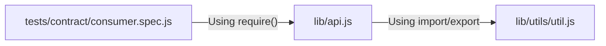

# Consumer Driven Contract Testing with Pact

## Problem

Setup consumer based contract tests (using pact) with a pre-existing library that uses both 
CommonJS and ES modules, and allow Pact activities to be managed independently of other Karma 
based tests. All without changing the package.json "type" property.

## Possible Solutions 

1. Webpack/babel intercept incoming scripts to ensure commonJS format

### Module sample structure

## Terminology

- `Consumer` - A service/component calling another service e.g. via a HTTP/REST API call, independent of the data flow direction (it does not matter if the HTTP request is a GET, PUT, POST, PATCH or DELETE).
- `Provider` - A service/component being called from another service e.g. via a HTTP/REST interface. It may have more than one HTTP endpoint. It is semantically the same as the aforementioned producer. From this point on, we will use the term provider instead of producer. One producer can have more than one provider.
- `Mock Service Provider` - Used by tests in the consumer pipeline to mock the actual provider. Integration-like tests can be run without the actual provider.
  -`Interaction` - A request and response pair, e.g. a concrete GET request with its parameters and the response data.
- `Contract (or Pact file)` - A contract consists of a collection of interactions. Actually it is a JSON text file containing serialized interactions. The file is generated by running the consumer-side pact test. In addition it contains the consumer name, provider name, metadata with the pact specification version and the pact verfication.
- `Pact verification` - A Pact file is verified by replaying the requests against the (real) provider, the responses must match those in the Pact file.
- `Provider state` - Describes the state that the provider should be in when a given request is replayed and usually has a “fixture name” such as “when user Joe Doe exists”.
- `Pact specification` - It is a document describing the structure of the generated Pact file, allowing for interoperability between different languages/Pact implementations.
- `Pact broker` - The Pact Broker is a central application for sharing consumer driven contracts and verification results. It is optimised for use with Pact.

## See Also

- https://docs.pact.io/
- https://github.com/eon-com/toyapp-pact-demo
- https://pactflow.io/
